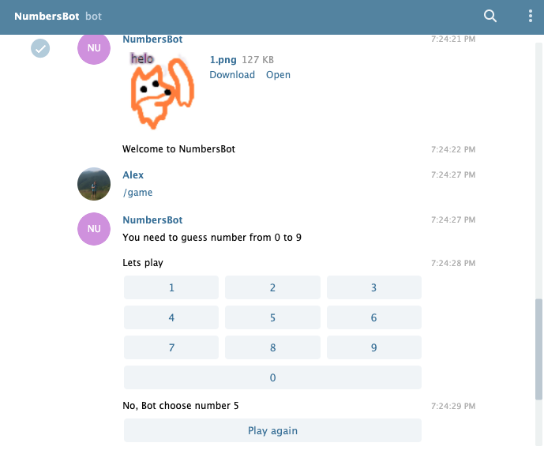

# Telegram Bot "NumbersBot"

You need to guess number from 0 to 9. Bot has commands: "/start", "/info", "/game", "/again". User can play game, if he lose he can start again. User can also get information about the number of successful and unsuccessful attempts. This information is stored and writed in db.

## Example 

## License

MIT